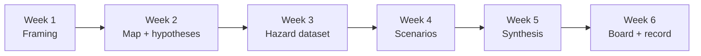

<div align="center">

# Climate Risk Course

**Six weeks to a climate risk assessment** — a hands-on [Grok Build](https://x.ai) course with three simulated clients, firm methodology, and board-ready deliverables.

[](https://github.com/rdsciv/ClimateRiskCourse/blob/main/LICENSE)
[](https://github.com/rdsciv/ClimateRiskCourse/actions)
[](https://github.com/rdsciv/ClimateRiskCourse/stargazers)
[](https://rdsciv.github.io/ClimateRiskCourse/)

[Live docs](https://rdsciv.github.io/ClimateRiskCourse/) · [Quickstart](https://rdsciv.github.io/ClimateRiskCourse/quickstart.html) · [Curriculum](https://rdsciv.github.io/ClimateRiskCourse/curriculum.html)

</div>

## What is this?

A training repo where you run a climate-risk **consulting engagement** with Grok Build: read the client file, map the book, score hazards, run scenarios, synthesize decisions, and ship dual-audience deliverables (board judgment + record pack). All client data is **simulated**.

You pick one track and keep it for six weeks:

| Key | Client | Decision language |
|-----|--------|-------------------|
| `colorado` | Redrock Basin Authority — Colorado River reservoirs | Releases, allocations, hydropower contingency |
| `kerrville` | City of Kerrville — flood risk (TX) | Mitigation priority, access, buyout vs defend |
| `datacenter` | Horizon Grid — Texas data center EIS | Alternatives, water, power/grid, receptors |

## Quick Start

**Requirements:** [Git](https://git-scm.com/), [uv](https://docs.astral.sh/uv/), [Grok Build](https://x.ai) authenticated.

Install uv once if needed:

```bash
curl -LsSf https://astral.sh/uv/install.sh | sh
```

Then:

```bash
# 1. Clone, then enter the folder
git clone https://github.com/rdsciv/ClimateRiskCourse.git
cd ClimateRiskCourse

# 2. Install dependencies
uv sync

# 3. Seed clients, pick a track, lint
uv run scripts/seed_all_clients.py
uv run scripts/set_track.py colorado   # or kerrville | datacenter
uv run scripts/course_lint.py

# 4. Open Grok Build in this repo → exercises/00-orientation
```

Use **`uv run`** for every course script. Do not call system `python3` or `pip`.

## How the engagement works



| Week | Question | Deliverable |
|------|----------|-------------|
| 0 | How do I take this? | Environment + track |
| 1 | What does the client need? | Framing & delivery plan |
| 2 | Where does risk concentrate? | Mapped book + hypotheses |
| 3 | Which hazard data matters? | Hazard dataset + audit log |
| 4 | Which scenarios bite? | Standard + bespoke results |
| 5 | What should change? | Synthesis + decisions |
| 6 | Will it stand up? | Board judgment + record |

### Epistemic rules

1. **Computed** figures come from saved scripts (`uv run`).
2. **Judged** figures carry mechanism + precedent + the word **judgment**.
3. Never invent government/vendor data pulls.
4. Document gaps; do not fill them silently.
5. **Do not sum** losses across scenarios.

## Project Structure

```
ClimateRiskCourse/
├── clients/                 # Three simulated engagement folders
│   ├── colorado-river-reservoirs/
│   ├── kerrville-flood/
│   └── texas-datacenter-eis/
├── docs/                    # Mintlify MDX source (docs.json + pages)
├── exercises/               # Weeks 0–6 (explainer / problem / solution)
│   ├── 00-orientation/
│   ├── 01-the-client/
│   ├── 02-portfolio-mapping/
│   ├── 03-hazard-data/
│   ├── 04-scenario-analysis/
│   ├── 05-portfolio-synthesis/
│   └── 06-delivery/
├── firm/                    # Methodology, scenarios, anchors, sample hazard
├── scripts/                 # Seed, lint, track, site build (always: uv run)
├── templates/               # Board + regulatory shells
├── AGENTS.md                # Firm-level Grok brief
├── CONTRIBUTING.md
├── INSTRUCTOR.md
├── package.json
└── pyproject.toml
```

## Documentation

| Resource | Description |
|----------|-------------|
| [Live site](https://rdsciv.github.io/ClimateRiskCourse/) | Public docs UI (GitHub Pages) |
| [docs/](docs/) | Mintlify source (`npx mintlify dev` from `docs/`) |
| [firm/methodology.md](firm/methodology.md) | Firm method: computed vs judged, dual audiences |
| [clients/README.md](clients/README.md) | Track chooser and folder layout |
| [exercises/](exercises/) | Hands-on curriculum |
| [CONTRIBUTING.md](CONTRIBUTING.md) | Local dev and PR checklist |
| [INSTRUCTOR.md](INSTRUCTOR.md) | Live-session and grading notes |

### Common scripts

| Command | Purpose |
|---------|---------|
| `uv run scripts/seed_all_clients.py` | Build all SQLite books |
| `uv run scripts/set_track.py <track>` | Activate `colorado` \| `kerrville` \| `datacenter` |
| `uv run scripts/course_lint.py` | Structure checks |
| `uv run scripts/list_exercises.py` | Print syllabus |
| `uv run scripts/build_cool_site.py` | Rebuild public site into `site/` |
| `uv run scripts/export_deliverable.py FILE.md` | Markdown → HTML |

## Contributing

See [CONTRIBUTING.md](CONTRIBUTING.md). Keep client data labeled **simulated**, use `uv run` in student-facing docs, and run `uv run scripts/course_lint.py` before PRs.

<a href="https://github.com/rdsciv/ClimateRiskCourse/graphs/contributors">
  
</a>

## License

MIT — see [LICENSE](LICENSE). Simulated training data for educational use.

---

<div align="center">

[](https://star-history.com/#rdsciv/ClimateRiskCourse&Date)

</div>
